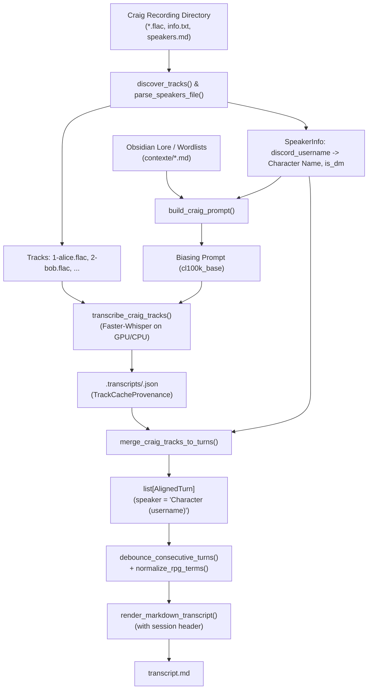

# Craig Multi-Track Adapter Design Spec

**Date:** 2026-09-29  
**Status:** Approved  
**Author:** Antigravity  
**Target:** `a2ts` (v0.2.0.dev1)  

---

## 1. Overview & Problem Statement

Craig is a popular Discord multi-track recording bot for tabletop RPGs and podcasts. Each speaker is recorded to an individual audio track (`<track_number>-<discord_username>.flac`). Alongside tracks, Craig produces session metadata in `info.txt`, and campaigns frequently maintain character rosters in `speakers.md`.

Currently, `a2ts` only accepts single-stream audio/video and relies on acoustic diarization (Nemotron-3 or ECAPA-TDNN) to separate voices. For Craig recordings, acoustic diarization is unnecessary and counterproductive: physical speaker separation is already guaranteed by the multi-track source.

This design introduces a first-class **Craig Multi-Track Adapter** into `a2ts`, exposed via the `a2ts craig` subcommand, replacing the standalone `craig2ts` tool with a unified transcription architecture.

---

## 2. Architecture & Components



### 2.1 Subsystem Responsibilities

1. **`src/a2ts/craig.py`**:
   - `discover_tracks(recording_dir: Path) -> list[Path]`: Finds tracks matching `^\d+-.*\.flac`, numerically sorted by index prefix.
   - `parse_track_username(path: Path) -> str`: Extracts Discord username from filename (e.g. `1-merrow1.flac` -> `merrow1`).
   - `parse_speakers_file(path: Path) -> dict[str, SpeakerInfo]`: Parses `speakers.md` lines (`- username: Character, role, surnoms: (nicknames)` and `MJ` markers).
   - `parse_info_file(path: Path) -> dict[str, Any]`: Parses Craig `info.txt` (guild, channel, start time, user IDs).
   - `find_speakers_file(recording_dir: Path, custom_path: Path | None = None) -> Path | None`: Discovers `speakers.md` in recording directory, parent directory, or working directory.
   - `build_craig_prompt(speakers: dict[str, SpeakerInfo], context_dir: Path | None) -> str`: Assembles token-budgeted prompt containing speaker/character names and Obsidian lore terms.
   - `transcribe_craig_track(model, track_path, provenance, cache_path, force=False) -> list[RawSegment]`: Transcribes single track with Faster-Whisper, storing atomic JSON cache.
   - `merge_craig_tracks_to_turns(track_segments: list[tuple[str, RawSegment]], speakers: dict[str, SpeakerInfo]) -> list[AlignedTurn]`: Chronologically interleaves track segments sorted by `(start, track_id)`, formatting speaker labels as `Character (username)` or `MJ (username)`.

2. **Integration with Existing Subsystems**:
   - `a2ts.consolidator.debounce_consecutive_turns()`: Merges contiguous same-speaker turns (< 2.0s gap) and applies `normalize_rpg_terms()`.
   - `a2ts.consolidator.render_markdown_transcript()`: Renders markdown transcript.
   - `a2ts.refiner.refine_transcript_markdown()`: Optional post-processing pass via local `agy` CLI when `--refine` is passed.

---

## 3. Data Models (`a2ts/models.py`)

Add to `src/a2ts/models.py`:

```python
class SpeakerInfo(BaseModel):
    discord_username: str
    character_name: str
    role: str | None = None
    nicknames: list[str] = Field(default_factory=list)
    is_dm: bool = False
    raw_description: str | None = None


class TrackCacheProvenance(BaseModel):
    schema_version: int = 1
    model_name: str
    compute_type: str
    prompt_hash: str
    vad_parameters: dict[str, Any] = Field(default_factory=dict)
    source_file_size: int
    source_file_mtime: float


class TrackCacheFile(BaseModel):
    provenance: TrackCacheProvenance
    segments: list[RawSegment]
```

---

## 4. CLI Contract

```bash
a2ts craig <recording_dir> [OPTIONS]
```

| Option | Type | Default | Description |
| :--- | :--- | :--- | :--- |
| `recording_dir` | `Path` (Arg) | *Required* | Path to folder containing Craig `.flac` tracks |
| `--model-name` | `str` | `large-v3` | Faster-Whisper model checkpoint |
| `--device` | `str` | `auto` | Device: `auto` (CUDA if available, else CPU), `cuda`, or `cpu` |
| `--compute-type` | `str` | `float16` | Precision: `float16`, `int8`, `float32` |
| `--context-dir` | `Path` | `contexte` | Obsidian notes directory for lore mining |
| `--speakers-file` | `Path` | `None` | Custom path to `speakers.md` |
| `--output` | `Path` | `None` | Output Markdown path (default: `<recording_dir>/transcript.md`) |
| `--debounce` | `float` | `2.0` | Gap in seconds to merge consecutive same-speaker turns |
| `--force` | `bool` | `False` | Force re-transcribing tracks, ignoring cache |
| `--refine / --no-refine` | `bool` | `False` | Run local LLM refinement pass via `agy` CLI |

---

## 5. Testing & Verification Plan

1. **Unit Tests (`tests/unit/test_craig.py`)**:
   - `test_discover_tracks`: Sorting `1-alpha.flac`, `2-beta.flac`, `10-gamma.flac`.
   - `test_parse_track_username`: Filename parsing with prefixes.
   - `test_parse_speakers_file`: Line matching, DM recognition, nicknames extraction.
   - `test_parse_info_file`: Header and track parsing.
   - `test_merge_craig_tracks_to_turns`: Interleaving segments and dual label resolution.
   - `test_craig_track_caching_and_provenance`: Cache write, provenance check, `--force` bypass.
2. **CLI Test (`tests/test_cli.py`)**:
   - `test_craig_command_full_e2e_mocked`: Mock WhisperModel, verify execution produces expected `transcript.md` with dice normalization and debounced turns.
3. **Quality Gates**:
   - `uv run ruff check --no-cache .`
   - `uv run mypy --cache-dir /tmp/mypy_cache src tests`
   - `uv run pytest -q -p no:cacheprovider`
