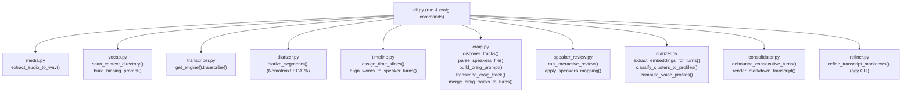

# a2ts Codebase Map (Codemap)

**Version**: 0.2.0  
**Project**: `a2ts` (Audio to Text / Transcript)  
**Governance Tier**: Tier B  
**Reference Design**: [design.md](./design.md)

---

## 1. Directory Structure

```
src/a2ts/
├── __init__.py           # Package version and top-level exports
├── cache.py              # Versioned cache management, atomic I/O & provenance checks
├── cli.py                # Typer CLI application, command dispatch & UX
├── consolidator.py       # Turn debouncing, RPG normalization & Markdown assembly
├── craig.py              # Craig multi-track audio discovery, roster parsing & interleaving
├── diarizer.py           # Nemotron-3 & SpeechBrain ECAPA diarization & voice profiles
├── media.py              # ffprobe metadata probing, SHA-256 hashing & ffmpeg extraction
├── models.py             # Pydantic data models for all domain entities & cache envelopes
├── refiner.py            # Local LLM transcript cleanup via external agy CLI
├── speaker_review.py     # Terminal QCM interactive review & label propagation
├── timeline.py           # Word-to-turn midpoint alignment & time-slice partitioning
├── transcriber.py        # Abstract ASR base class, Faster-Whisper & Voxtral engines
└── vocab.py              # Obsidian wikilink/alias lore mining & token budgeting
```

---

## 2. Module Directory & Responsibilities

| File | Primary Responsibility | Key Functions / Classes | Downstream Dependents |
| :--- | :--- | :--- | :--- |
| [`models.py`](../src/a2ts/models.py) | Pydantic data schemas & validation | `RawSegment`, `WordTimestamp`, `SpeakerTurn`, `AlignedTurn`, `VoiceProfile`, `VoiceProfilesDatabase`, `SpeakersMapping`, `SessionMetadata`, `TranscriptCacheFile`, `DiarizationCacheFile`, `SpeakerInfo`, `TrackCacheProvenance`, `TrackCacheFile` | All modules |
| [`cache.py`](../src/a2ts/cache.py) | Atomic cache storage & provenance validation | `atomic_write_text()`, `compute_prompt_hash()`, `save_transcript_cache()`, `load_transcript_cache()`, `save_diarization_cache()`, `load_diarization_cache()` | `cli.py`, `craig.py` |
| [`cli.py`](../src/a2ts/cli.py) | Top-level CLI orchestration & UX | `app`, `run()`, `craig()`, `review()`, `recluster()`, `split()`, `extract_vocab()`, `info()` | End user CLI (`a2ts`) |
| [`craig.py`](../src/a2ts/craig.py) | Craig multi-track discovery, parsing & interleaving | `discover_tracks()`, `parse_track_username()`, `parse_speakers_file()`, `parse_info_file()`, `find_speakers_file()`, `compute_track_provenance()`, `build_craig_prompt()`, `load_track_cache()`, `save_track_cache()`, `transcribe_craig_track()`, `merge_craig_tracks_to_turns()` | `cli.py`, `tests/` |
| [`media.py`](../src/a2ts/media.py) | Audio stream extraction & probing | `probe_media()`, `compute_file_hash()`, `extract_audio_to_wav()` | `cli.py` |
| [`vocab.py`](../src/a2ts/vocab.py) | Obsidian lore parsing & prompt budgeting | `scan_context_directory()`, `parse_markdown_file()`, `build_biasing_prompt()` | `cli.py`, `craig.py` |
| [`transcriber.py`](../src/a2ts/transcriber.py) | Speech-to-text inference engines | `BaseTranscriber`, `WhisperTranscriber`, `VoxtralTranscriber`, `get_engine()`, `WhisperEngine` | `cli.py` |
| [`diarizer.py`](../src/a2ts/diarizer.py) | Acoustic diarization & voice profiles | `get_nemotron_model()`, `diarize_nemotron()`, `get_embedding_model()`, `extract_embeddings()`, `extract_embeddings_for_turns()`, `diarize_segments()`, `classify_clusters_to_profiles()`, `compute_voice_profiles()`, `save_voice_profiles()`, `load_voice_profiles()` | `cli.py`, `tests/` |
| [`timeline.py`](../src/a2ts/timeline.py) | Temporal slicing & word alignment | `align_words_to_speaker_turns()`, `assign_time_slices()`, `split_cluster_at_time()` | `cli.py`, `speaker_review.py` |
| [`speaker_review.py`](../src/a2ts/speaker_review.py) | Interactive QCM & label propagation | `run_interactive_review()`, `apply_speakers_mapping()`, `propagate_speaker_labels()`, `save_speakers_mapping()` | `cli.py` |
| [`consolidator.py`](../src/a2ts/consolidator.py) | Turn debouncing & Markdown formatting | `debounce_consecutive_turns()`, `normalize_rpg_terms()`, `render_markdown_transcript()` | `cli.py` |
| [`refiner.py`](../src/a2ts/refiner.py) | External LLM transcript refinement | `refine_transcript_markdown()`, `build_refiner_prompt()`, `run_agy_refiner()` | `cli.py` |

---

## 3. Module Call Graph & Data Flow



---

## 4. Test Suite Map

```
tests/
├── integration/
│   └── test_pipeline_e2e.py    # End-to-end runs of the full CLI lifecycle
├── unit/
│   ├── test_models.py          # Pydantic schema validation & serialization
│   ├── test_cache.py           # Cache envelopes, provenance checks, atomic I/O
│   ├── test_craig.py           # Craig track discovery, parsing, caching & merge turns
│   ├── test_media.py           # ffprobe & ffmpeg extraction mocks
│   ├── test_vocab.py           # Wikilinks, aliases, and tiktoken prompt limits
│   ├── test_transcriber.py     # Whisper and Voxtral engine wrappers
│   ├── test_diarizer.py        # Nemotron-3, ECAPA clustering, & turn embeddings
│   ├── test_timeline.py        # Word alignment & time-slice cluster splitting
│   ├── test_speaker_review.py  # Interactive QCM, label propagation & mappings
│   ├── test_consolidator.py    # Contiguous turn debouncing, RPG normalization & Markdown
│   └── test_refiner.py         # Prompt generation & agy subprocess safety guards
└── test_cli.py                 # Comprehensive Typer runner CLI argument tests
```
