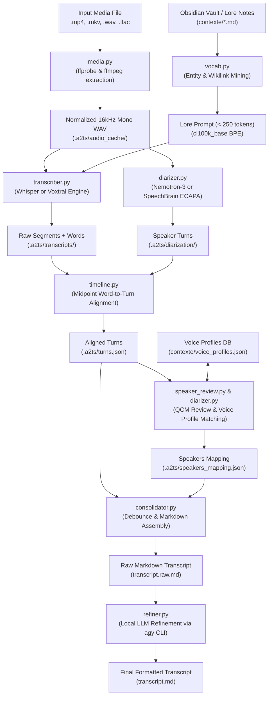
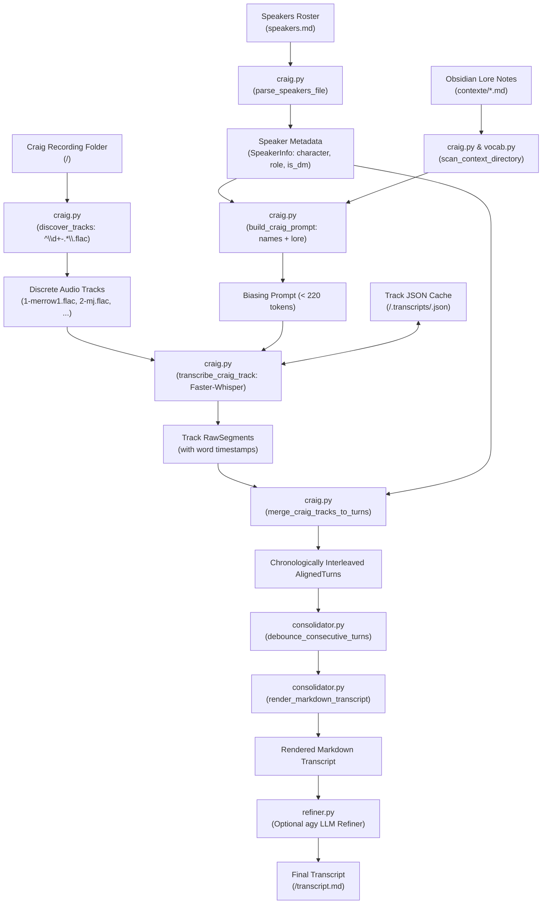

# a2ts System Architecture & Engineering Design

**Version**: 0.2.0  
**Project**: `a2ts` (Audio to Text / Transcript)  
**Governance Tier**: Tier B  
**Reference Specification**: [spec.md](./spec.md)

---

## 1. Architectural Overview & Data Flow

`a2ts` is structured as a staged, pipeline-driven CLI application. Each stage ingests immutable artifacts from the previous stage, produces validated Pydantic data structures, and persists intermediate representations into `.a2ts/` caching directories.



### 1.2 Craig Multi-Track Pipeline Data Flow

When processing multi-track Discord recordings captured by Craig, speaker isolation is physical (per-track audio files), bypassing acoustic diarization:



---

## 2. Pipeline Subsystems

### 2.1 Media Stream Extraction (`media.py`)
- **Probing**: Uses `ffprobe -v quiet -print_format json -show_format -show_streams` to determine codec, channels, sample rate, and exact duration in seconds.
- **Audio Hashing**: Computes streaming SHA-256 across the full file bytes in 64 KiB chunks to uniquely identify recordings and detect tail/metadata modifications.
- **WAV Normalization**: Executes `ffmpeg -y -i <input> -vn -acodec pcm_s16le -ar 16000 -ac 1 <output.wav>` creating a canonical 16 kHz 16-bit mono stream in `.a2ts/audio_cache/`.

### 2.2 Contextual Vocabulary Mining (`vocab.py`)
- Traverses the context folder recursively matching `*.md` files.
- Identifies three classes of vocabulary tokens:
  1. YAML Frontmatter: values under `aliases:` lists.
  2. Wikilinks: internal references formatted as `[[Entity Name]]` or `[[Target|Alias]]`.
  3. Structural Headings: markdown headers (`# Title`, `## Subheading`).
- Sorts entities by frequency and length, deduplicates case-insensitively, and encodes with OpenAI `cl100k_base` BPE tokenizer (`tiktoken`).
- Truncates to a fixed token budget (default: 250 tokens) to fit within ASR prompt limits without degrading acoustic attention.

### 2.3 Dual-Engine Speech Recognition (`transcriber.py`)
The pipeline abstracts ASR implementations behind `BaseTranscriber`:
- **`WhisperTranscriber`**:
  - Encapsulates `faster_whisper.WhisperModel`.
  - Configured with `beam_size=5`, `vad_filter=True`, `word_timestamps=True`.
  - Feeds the mined lore prompt via the `initial_prompt` parameter.
  - Produces `RawSegment` instances with sub-segment `WordTimestamp` arrays.
- **`VoxtralTranscriber`**:
  - Wraps Mistral AI's multimodal model (`mistralai/Voxtral-Mini-3B-2507`) using Hugging Face `transformers`.
  - Ingests raw audio waveform and prompt context, generating transcripts natively.

### 2.4 Hybrid Acoustic Diarization & Speaker Identification (`diarizer.py`)

Diarization solves **who spoke when**; identification solves **who is who**. `a2ts` decouples these into an optimal hybrid architecture:

1. **Turn Diarization (Nemotron-3)**:
   - Loads `nvidia/Nemotron-3-Diarization` (100M parameter Transformer encoder, RoPE).
   - Generates frame-level speaker activity probabilities at 10ms–80ms resolution for up to 8 speakers.
   - Detects simultaneous cross-talk and overlapping speech directly.
   - Operates independently of ASR boundaries, producing raw continuous `SpeakerTurn` slices.
2. **Turn Embedding & Profile Matching (ECAPA-TDNN)**:
   - When `--voice-profiles` is supplied, extracts 192-dimensional embeddings for each Nemotron turn (>= 0.15s) using `speechbrain/spkrec-ecapa-voxceleb`.
   - Compares turn embeddings against enrolled centroids in `VoiceProfilesDatabase` via cosine similarity.
   - If similarity exceeds `--profile-threshold` (default 0.60), automatically tags the cluster with the enrolled person's name (e.g. `SPEAKER_00 -> "Quillon"`).
3. **On-Demand Execution**:
   - If `--voice-profiles` is not requested and no named speaker overrides exist, ECAPA is never loaded. The pipeline runs at pure Nemotron speed (~130x real-time).

### 2.5 Timeline Alignment & Slicing (`timeline.py`)
- Projects words onto speaker turns: for each `WordTimestamp`, calculates midpoint `(start + end) / 2` and attributes word to the active `SpeakerTurn`.
- Groups turns into configurable temporal windows (e.g. 15-minute time slices) using `assign_time_slices()`.
- Supports temporal cluster division (`split_cluster_at_time()`) when a single acoustic cluster inadvertently spans distinct speakers.

### 2.6 Interactive Attribution (`speaker_review.py`)
- Evaluates candidate names from `speakers.txt` or context lore against cluster turn counts and durations.
- Presents a terminal-based QCM menu using Rich and Typer.
- Plays short audio excerpts around representative quotes via `ffplay` or `aplay` (with configurable `--audio-padding`).
- Propagates identified speaker names forwards and backwards across ambiguous turns.

### 2.7 Consolidation & Post-Processing (`consolidator.py` & `refiner.py`)
- **Debouncing**: Contiguous turns with matching speaker IDs separated by <= 2.0s are concatenated into a single turn block.
- **Deterministic French Tabletop RPG Normalization (`normalize_rpg_terms`)**:
  - Replaces speech-recognition artifacts for dice notations (`lance un dé 20` -> `lance 1d20`, `trois dés de six` -> `3d6`).
  - Guards against noun confusion (`20 gardes`, `10 minutes`, `6 joueurs`).
  - Replaces phonetic artifacts (`jets-dés`, `jet de délai` -> `jets de dés` / `jet de dés`).
- **Markdown Rendering**: Formats speech into Markdown blocks with clickable anchor headers:
  ```markdown
  ### [00:15:30 - 00:15:45] Dorsa
  
  Je lance 1d20 sur le coffre.
  ```
- **Local LLM Refinement**:
  - Builds an instruction prompt with context lore.
  - Invokes local `agy` CLI via subprocess (`agy -m <model> --system <prompt>`).
  - Formats table banter, dice rolls, and out-of-character comments into standard GitHub alerts (`> [!NOTE] Hors-jeu`).
  - Guards against hallucination by verifying that character edit distance remains within safe bounds.

### 2.8 Craig Multi-Track Processing Pipeline (`craig.py`)
- **Track Discovery & Username Extraction**: Scans `recording_dir` matching `^(\d+)-(.*)\.flac$` sorted numerically by track index. Extracts Discord usernames directly from track file stems (e.g. `1-merrow1.flac` -> `merrow1`).
- **Speaker Roster Parsing (`speakers.md`)**: Parses lines formatted as `* username: Character Name, Role, surnoms: (Nick1, Nick2)`. Detects Game Master roles (`is_dm`) via regex matching keywords (`MJ`, `DM`, `GM`, `Maître du Jeu`). Falls back to track username when unmapped.
- **Recording Metadata Parsing (`info.txt`)**: Extracts guild, channel, start time, and registered Discord user IDs from Craig's metadata summary.
- **Context-Aware Biasing Prompt**: Combines character names, nicknames, and Discord usernames with mined Obsidian lore (`vocab.py`), budgeted to 220 tokens to maximize transcription accuracy for fantasy terminology.
- **Discrete Track Caching**: Transcribes each audio track independently with Faster-Whisper. Caches raw segments with word timestamps in `<recording_dir>/.transcripts/<track_stem>.json` under a `TrackCacheProvenance` envelope. Invalidation checks track file mtime, size, model name, compute type, and prompt hash.
- **Chronological Segment Interleaving**: Interleaves multi-track segments using `merge_craig_tracks_to_turns()` sorted by `(seg.start, track_id)`. Bypasses acoustic diarization and clustering entirely because physical track separation provides exact speaker isolation.
- **Debouncing & Refinement**: Seamlessly chains into `consolidator.py` (`debounce_consecutive_turns()`, `render_markdown_transcript()`) and optional `refiner.py` (`refine_transcript_markdown()`).

---

## 3. Data Models (`models.py`)

All core entities inherit from `pydantic.BaseModel` with strict field typing:

```python
class WordTimestamp(BaseModel):
    word: str
    start: float
    end: float
    probability: float = 1.0


class RawSegment(BaseModel):
    id: int
    start: float
    end: float
    text: str
    words: list[WordTimestamp] = []


class SpeakerTurn(BaseModel):
    id: int
    start: float
    end: float
    cluster_id: str
    resolved_speaker: str | None = None
    confidence: float = 1.0
    time_slice_id: int = 0
    flagged: bool = False


class AlignedTurn(BaseModel):
    turn_id: int
    start: float
    end: float
    speaker: str
    cluster_id: str
    text: str
    words: list[WordTimestamp] = []
    time_slice_id: int = 0
    flagged: bool = False


class VoiceProfile(BaseModel):
    speaker_name: str
    centroid: list[float]
    sample_count: int = 1
    sample_ids: list[str] = Field(default_factory=list)


class VoiceProfilesDatabase(BaseModel):
    version: int = 1
    speakers: dict[str, VoiceProfile] = Field(default_factory=dict)


class TranscriptCacheProvenance(BaseModel):
    schema_version: int = 1
    media_hash: str
    engine: str
    model_name: str
    compute_type: str
    prompt_hash: str


class TranscriptCacheFile(BaseModel):
    provenance: TranscriptCacheProvenance
    segments: list[RawSegment]


class DiarizationCacheProvenance(BaseModel):
    schema_version: int = 1
    media_hash: str
    engine: str
    cluster_threshold: float
    num_speakers: int | None = None
    device: str = "cuda"


class DiarizationCacheFile(BaseModel):
    provenance: DiarizationCacheProvenance
    turns: list[SpeakerTurn]


class SpeakersMapping(BaseModel):
    cluster_defaults: dict[str, str] = Field(default_factory=dict)
    turn_overrides: dict[int, str] = Field(default_factory=dict)


class SessionMetadata(BaseModel):
    session_id: str
    audio_file: str
    file_hash: str
    duration_seconds: float
    created_at: str
    engine: str
    model_name: str
    time_slices_count: int
    speakers_detected: list[str]


class SpeakerInfo(BaseModel):
    discord_username: str
    character_name: str
    role: str | None = None
    nicknames: list[str] = Field(default_factory=list)
    is_dm: bool = False
    raw_description: str | None = None


class TrackCacheProvenance(BaseModel):
    schema_version: int = 1
    model_name: str
    compute_type: str
    prompt_hash: str
    vad_parameters: dict[str, Any] = Field(default_factory=dict)
    source_file_size: int
    source_file_mtime: float


class TrackCacheFile(BaseModel):
    provenance: TrackCacheProvenance
    segments: list[RawSegment]
```

---

## 4. Cache & Storage Architecture

### 4.1 Single-Stream Pipeline Cache (`.a2ts/`)

All single-stream session artifacts are stored inside `.a2ts/`:

```
.a2ts/
├── audio_cache/
│   └── <sha256>.wav                  # Extracted 16kHz mono audio
├── transcripts/
│   └── <sha256>_<engine>.json        # Provenance envelope + raw ASR segments
├── diarization/
│   ├── <sha256>.json                 # Provenance envelope + diarization turns
│   ├── <sha256>_turn_embeddings.npy  # Turn embeddings (192-dim, keyed by turn_id)
│   ├── <sha256>_turn_indices.json    # Valid embedding turn IDs
│   ├── <sha256>_segment_embeddings.npy # Segment embeddings (keyed by seg.id)
│   └── <sha256>_segment_indices.json # Valid segment IDs
├── turns.json                        # AlignedTurn representation for session
├── speakers_mapping.json             # Manual & automatic speaker resolutions
└── session.json                      # Comprehensive provenance metadata
```

### 4.2 Craig Multi-Track Cache (`<recording_dir>/.transcripts/`)

For multi-track recordings processed via `a2ts craig`, intermediate per-track transcripts are cached locally within the recording directory:

```
<recording_dir>/
├── 1-merrow1.flac                    # Per-user audio tracks
├── 2-mj.flac
├── info.txt                          # Optional recording metadata from Craig
├── speakers.md                       # Optional speaker identity roster
├── transcript.md                     # Final assembled transcript output
└── .transcripts/                     # Discrete per-track transcription cache
    ├── 1-merrow1.json                # TrackCacheFile (TrackCacheProvenance + RawSegments)
    └── 2-mj.json
```

---

## 5. Hardware & Memory Footprint

Tested execution budget on NVIDIA GeForce RTX 3080 (10 GB VRAM):

| Component | Precision | VRAM Allocated | VRAM Reserved | Processing Speed |
| :--- | :--- | :--- | :--- | :--- |
| **Nemotron-3 Diarization** | FP16 | ~210 MB | ~266 MB | ~130x real-time |
| **SpeechBrain ECAPA-TDNN** | FP32 | ~143 MB | ~160 MB | ~30x real-time |
| **Faster-Whisper Large-v3** | FP16 | ~3.1 GB | ~3.8 GB | ~15-25x real-time |
| **Faster-Whisper Turbo** | FP16 | ~1.6 GB | ~2.1 GB | ~35-50x real-time |
| **Voxtral-Mini-3B** | 4-bit / 8-bit | ~2.5 - 4.5 GB | ~5.0 GB | ~10-15x real-time |

Peak concurrent VRAM usage across the entire pipeline remains comfortably below **6.0 GB**, allowing smooth execution on standard 8 GB and 10 GB consumer GPUs.
